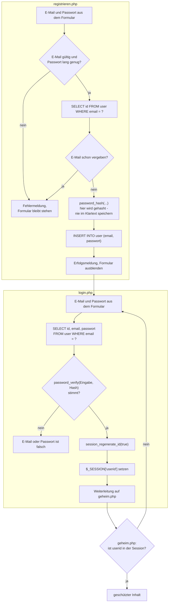

# Registrierung und Login Schritt für Schritt

Quelle: Q2.pdf S. 171–190

```mermaid
flowchart TD
    subgraph R["registrieren.php"]
        R1["E-Mail und Passwort aus dem Formular"]
        R2{"E-Mail gültig und<br>Passwort lang genug?"}
        R3["SELECT id FROM user WHERE email = ?"]
        R4{"E-Mail schon vergeben?"}
        R5["password_hash(...)<br>hier wird gehasht -<br>nie im Klartext speichern"]
        R6["INSERT INTO user (email, passwort)"]
        R7["Erfolgsmeldung, Formular ausblenden"]
        RF["Fehlermeldung,<br>Formular bleibt stehen"]
    end

    subgraph L["login.php"]
        L1["E-Mail und Passwort aus dem Formular"]
        L2["SELECT id, email, passwort<br>FROM user WHERE email = ?"]
        L3{"password_verify(Eingabe, Hash)<br>stimmt?"}
        L4["session_regenerate_id(true)"]
        L5["$_SESSION['userid'] setzen"]
        L6["Weiterleitung auf geheim.php"]
        LF["E-Mail oder Passwort ist falsch"]
    end

    G{"geheim.php:<br>ist userid in der Session?"}
    GJ["geschützter Inhalt"]

    R1 --> R2
    R2 -- nein --> RF
    R2 -- ja --> R3
    R3 --> R4
    R4 -- ja --> RF
    R4 -- nein --> R5
    R5 --> R6
    R6 --> R7
    R7 --> L1
    L1 --> L2
    L2 --> L3
    L3 -- nein --> LF
    L3 -- ja --> L4
    L4 --> L5
    L5 --> L6
    L6 --> G
    G -- ja --> GJ
    G -- nein --> L1
```
