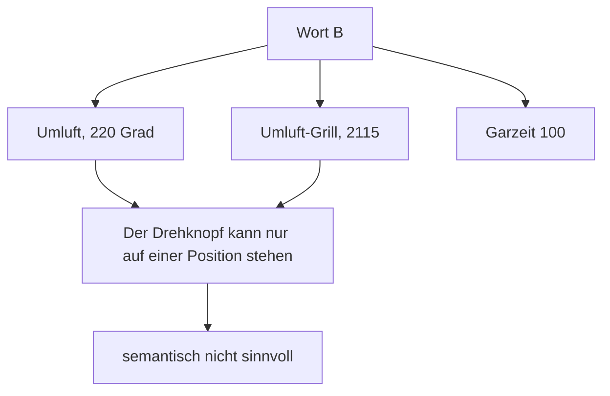

# Woran Wort B scheitert: zwei Betriebsarten auf einmal

Quelle: Q3.pdf S. 1

```mermaid
flowchart TD
    W["Wort B"] --> B1["Umluft, 220 Grad"]
    W --> B2["Umluft-Grill, 2115"]
    W --> B3["Garzeit 100"]
    B1 --> K["Der Drehknopf kann nur auf einer Position stehen"]
    B2 --> K
    K --> X["semantisch nicht sinnvoll"]
```
