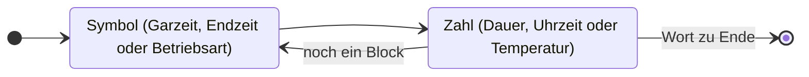

# Wie ein Wort auf dem Backofen-Display aufgebaut ist

Quelle: Q3.pdf S. 1

```mermaid
stateDiagram-v2
    direction LR
    [*] --> Symbol
    Symbol : Symbol (Garzeit, Endzeit oder Betriebsart)
    Zahl : Zahl (Dauer, Uhrzeit oder Temperatur)
    Symbol --> Zahl
    Zahl --> Symbol : noch ein Block
    Zahl --> [*] : Wort zu Ende
```
