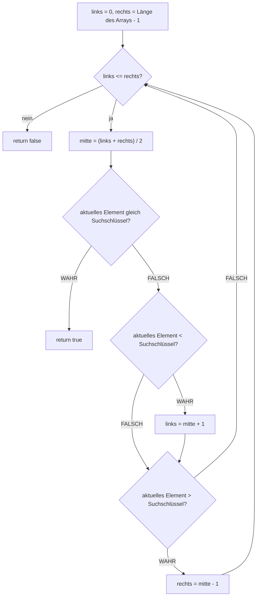

# Wie die binäre Suche den Bereich halbiert

Quelle: Q1.2.pdf S. 11

```mermaid
flowchart TD
    A["links = 0, rechts = Länge des Arrays - 1"] --> B{"links <= rechts?"}
    B -- nein --> Z["return false"]
    B -- ja --> C["mitte = (links + rechts) / 2"]
    C --> D{"aktuelles Element gleich Suchschlüssel?"}
    D -- WAHR --> T["return true"]
    D -- FALSCH --> E{"aktuelles Element < Suchschlüssel?"}
    E -- WAHR --> F["links = mitte + 1"]
    E -- FALSCH --> G{"aktuelles Element > Suchschlüssel?"}
    F --> G
    G -- WAHR --> H["rechts = mitte - 1"]
    G -- FALSCH --> B
    H --> B
```
