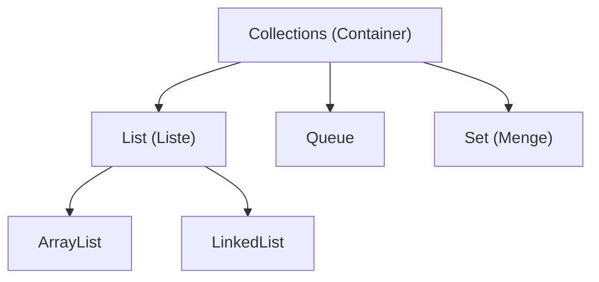

# Wo die ArrayList in der Hierarchie sitzt

Quelle: Q1.1.pdf S. 121

```mermaid
flowchart TD
    C["Collections (Container)"] --> L["List (Liste)"]
    C --> Q["Queue"]
    C --> S["Set (Menge)"]
    L --> A["ArrayList"]
    L --> LL["LinkedList"]
```
