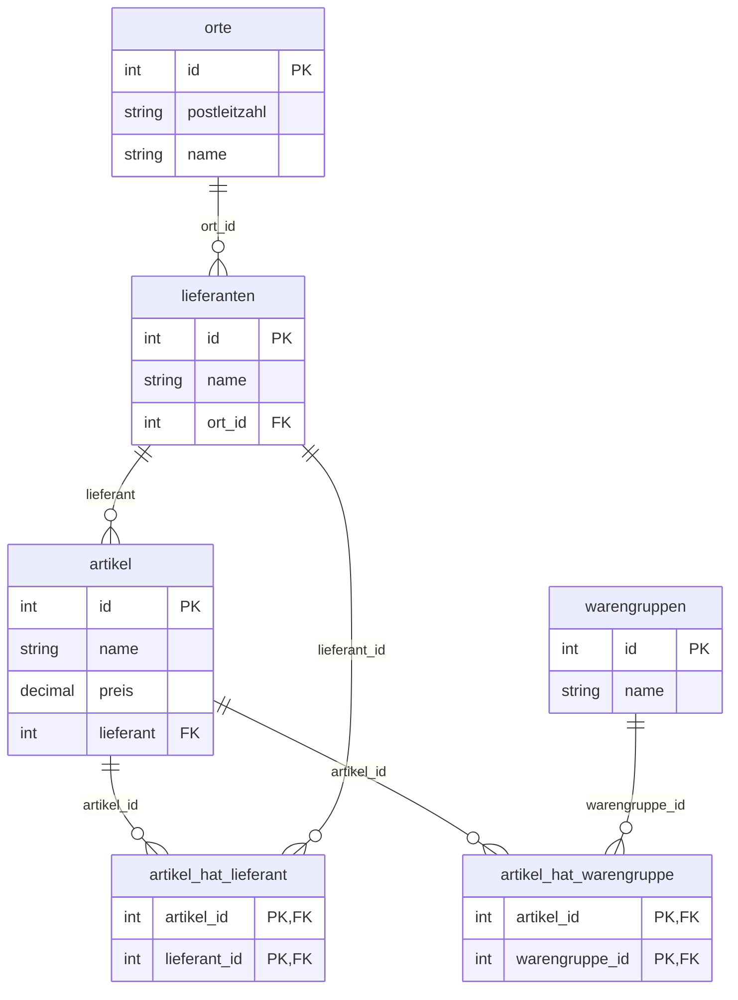

# Wer im Warenbestand auf wen zeigt

Quelle: Q2.pdf S. 45

```mermaid
erDiagram
    orte ||--o{ lieferanten : "ort_id"
    lieferanten ||--o{ artikel : "lieferant"
    artikel ||--o{ artikel_hat_lieferant : "artikel_id"
    lieferanten ||--o{ artikel_hat_lieferant : "lieferant_id"
    artikel ||--o{ artikel_hat_warengruppe : "artikel_id"
    warengruppen ||--o{ artikel_hat_warengruppe : "warengruppe_id"
    orte {
        int id PK
        string postleitzahl
        string name
    }
    lieferanten {
        int id PK
        string name
        int ort_id FK
    }
    artikel {
        int id PK
        string name
        decimal preis
        int lieferant FK
    }
    artikel_hat_lieferant {
        int artikel_id PK, FK
        int lieferant_id PK, FK
    }
    warengruppen {
        int id PK
        string name
    }
    artikel_hat_warengruppe {
        int artikel_id PK, FK
        int warengruppe_id PK, FK
    }
```
