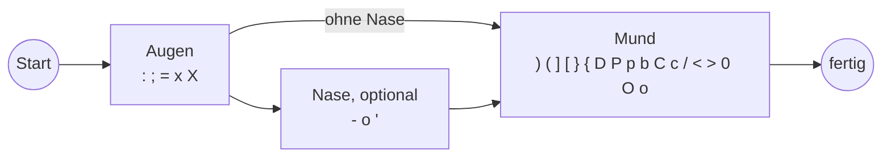

# Wie ein Emoticon aus seinen Bausteinen zusammengesetzt wird

Quelle: Q3.pdf S. 3

```mermaid
flowchart LR
    S(("Start")) --> A["Augen<br>: ; = x X"]
    A --> N["Nase, optional<br>- o '"]
    A -->|ohne Nase| M
    N --> M["Mund<br>) ( ] [ } { D P p b C c / &lt; &gt; 0 O o"]
    M --> E(("fertig"))
```
