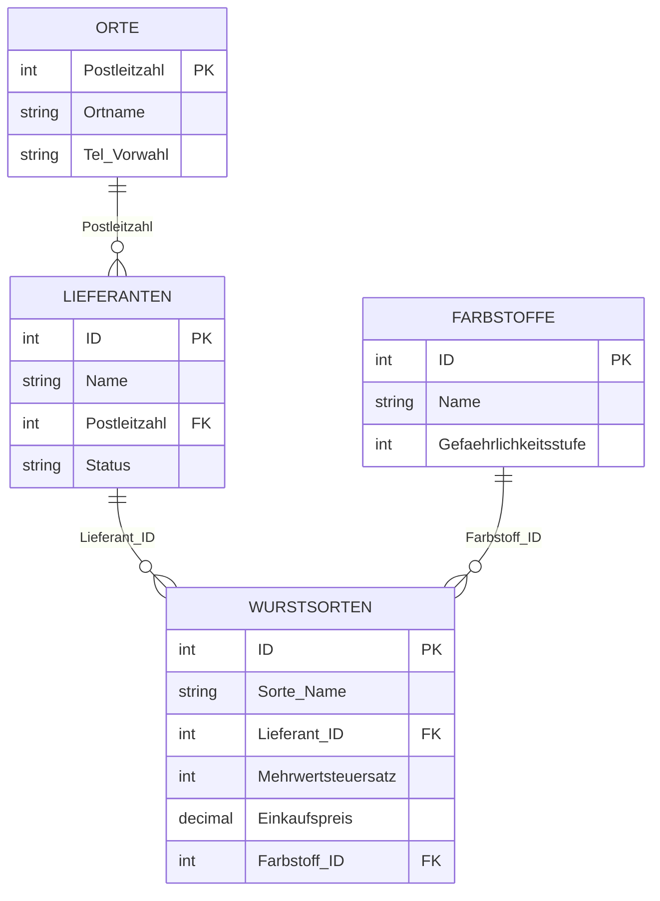

# Wer bei den Wurstsorten auf wen zeigt

Quelle: Q2.pdf S. 28–29

```mermaid
erDiagram
    ORTE ||--o{ LIEFERANTEN : "Postleitzahl"
    LIEFERANTEN ||--o{ WURSTSORTEN : "Lieferant_ID"
    FARBSTOFFE ||--o{ WURSTSORTEN : "Farbstoff_ID"
    WURSTSORTEN {
        int ID PK
        string Sorte_Name
        int Lieferant_ID FK
        int Mehrwertsteuersatz
        decimal Einkaufspreis
        int Farbstoff_ID FK
    }
    FARBSTOFFE {
        int ID PK
        string Name
        int Gefaehrlichkeitsstufe
    }
    LIEFERANTEN {
        int ID PK
        string Name
        int Postleitzahl FK
        string Status
    }
    ORTE {
        int Postleitzahl PK
        string Ortname
        string Tel_Vorwahl
    }
```
