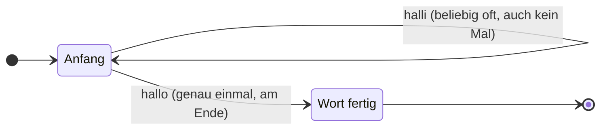

# Wie ein Wort der Sprache hallihallo entsteht

Quelle: Q3.pdf S. 4–5

```mermaid
stateDiagram-v2
    direction LR
    [*] --> Anfang
    Anfang : Anfang
    Fertig : Wort fertig
    Anfang --> Anfang : halli (beliebig oft, auch kein Mal)
    Anfang --> Fertig : hallo (genau einmal, am Ende)
    Fertig --> [*]
```
