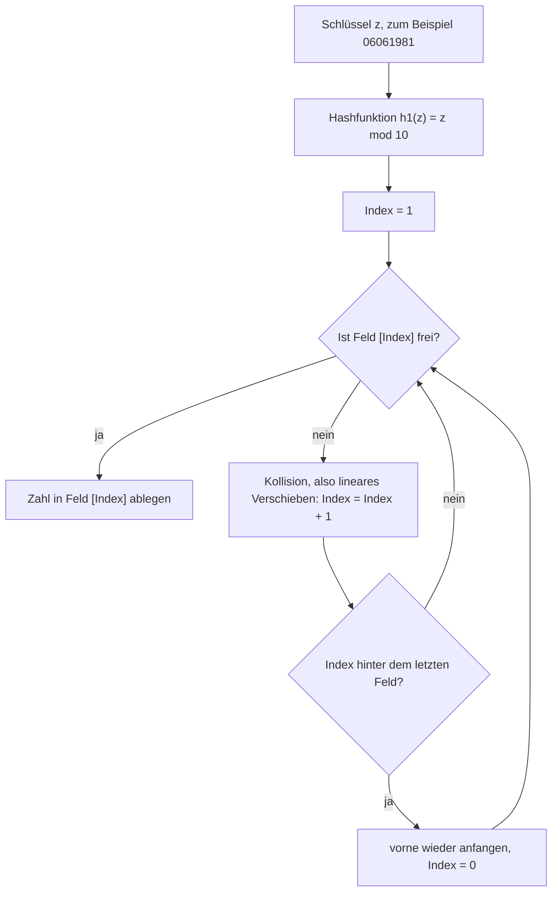

# Was beim Hashing passiert, wenn der Platz schon belegt ist

Quelle: Q1.2.pdf S. 12–13

```mermaid
flowchart TD
    A["Schlüssel z, zum Beispiel 06061981"] --> B["Hashfunktion h1(z) = z mod 10"]
    B --> C["Index = 1"]
    C --> D{"Ist Feld [Index] frei?"}
    D -- ja --> E["Zahl in Feld [Index] ablegen"]
    D -- nein --> F["Kollision, also lineares Verschieben: Index = Index + 1"]
    F --> G{"Index hinter dem letzten Feld?"}
    G -- ja --> H["vorne wieder anfangen, Index = 0"]
    G -- nein --> D
    H --> D
```
