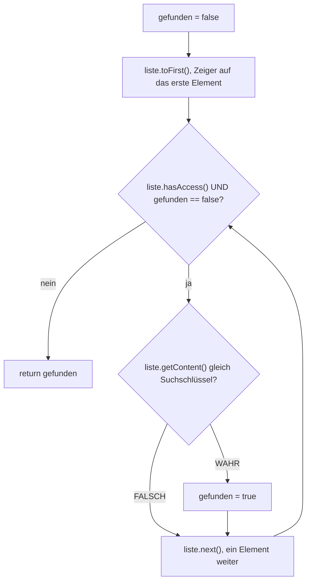

# Wie man eine lineare Liste von vorne durchgeht

Quelle: Q1.2.pdf S. 43

```mermaid
flowchart TD
    A["gefunden = false"] --> B["liste.toFirst(), Zeiger auf das erste Element"]
    B --> C{"liste.hasAccess() UND gefunden == false?"}
    C -- nein --> Z["return gefunden"]
    C -- ja --> D{"liste.getContent() gleich Suchschlüssel?"}
    D -- WAHR --> E["gefunden = true"]
    D -- FALSCH --> F["liste.next(), ein Element weiter"]
    E --> F
    F --> C
```
