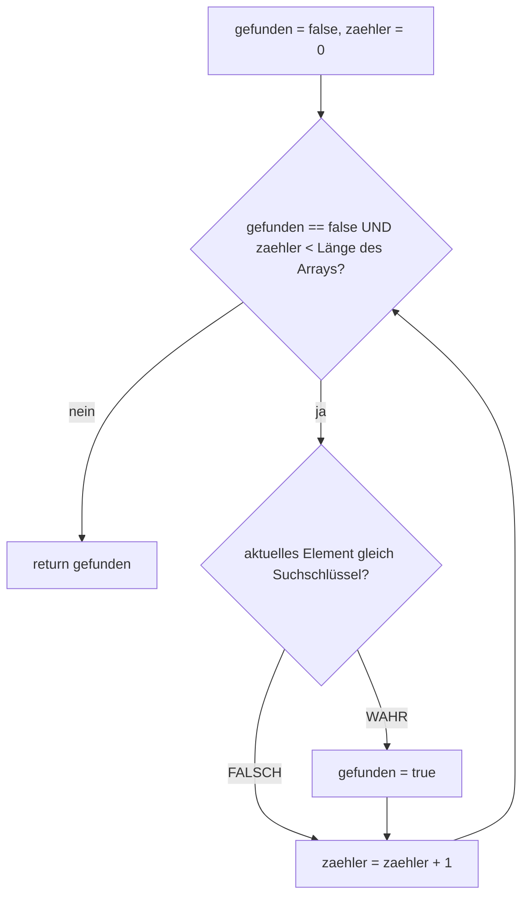

# Wie die lineare Suche Feld für Feld weitergeht

Quelle: Q1.2.pdf S. 8

```mermaid
flowchart TD
    A["gefunden = false, zaehler = 0"] --> B{"gefunden == false UND zaehler < Länge des Arrays?"}
    B -- nein --> Z["return gefunden"]
    B -- ja --> C{"aktuelles Element gleich Suchschlüssel?"}
    C -- WAHR --> D["gefunden = true"]
    C -- FALSCH --> E["zaehler = zaehler + 1"]
    D --> E
    E --> B
```
