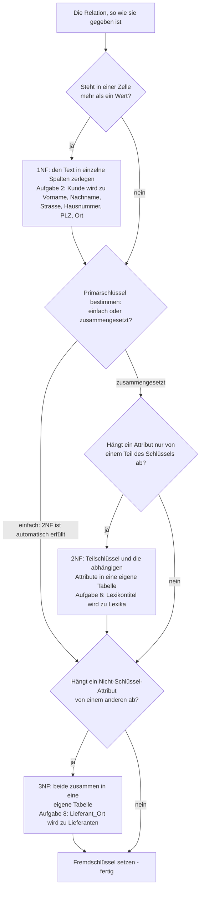

# Was in welchem Schritt herausgezogen wird

Quelle: Q2.pdf S. 102–104

```mermaid
flowchart TD
    A["Die Relation, so wie sie gegeben ist"]
    B{"Steht in einer Zelle<br>mehr als ein Wert?"}
    B1["1NF: den Text in einzelne Spalten zerlegen<br>Aufgabe 2: Kunde wird zu Vorname, Nachname,<br>Strasse, Hausnummer, PLZ, Ort"]
    C{"Primärschlüssel bestimmen:<br>einfach oder zusammengesetzt?"}
    D{"Hängt ein Attribut nur von<br>einem Teil des Schlüssels ab?"}
    D1["2NF: Teilschlüssel und die abhängigen<br>Attribute in eine eigene Tabelle<br>Aufgabe 6: Lexikontitel wird zu Lexika"]
    E{"Hängt ein Nicht-Schlüssel-Attribut<br>von einem anderen ab?"}
    E1["3NF: beide zusammen in eine<br>eigene Tabelle<br>Aufgabe 8: Lieferant_Ort wird zu Lieferanten"]
    F["Fremdschlüssel setzen - fertig"]

    A --> B
    B -- ja --> B1
    B1 --> C
    B -- nein --> C
    C -- "einfach: 2NF ist automatisch erfüllt" --> E
    C -- zusammengesetzt --> D
    D -- ja --> D1
    D1 --> E
    D -- nein --> E
    E -- ja --> E1
    E1 --> F
    E -- nein --> F
```
