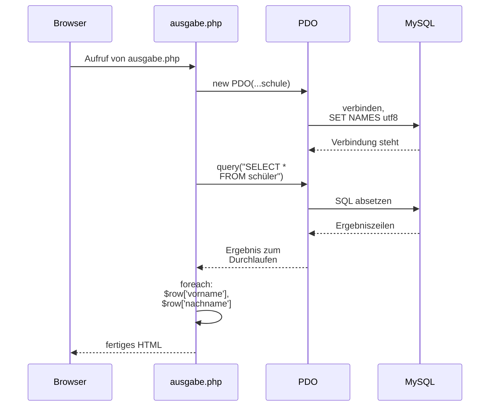

# Der Weg vom Browser zur Datenbank und zurück

Quelle: Q2.pdf S. 154–163

```mermaid
sequenceDiagram
    participant B as Browser
    participant P as ausgabe.php
    participant D as PDO
    participant M as MySQL

    B->>P: Aufruf von ausgabe.php
    P->>D: new PDO(...schule)
    D->>M: verbinden,<br>SET NAMES utf8
    M-->>D: Verbindung steht
    P->>D: query("SELECT *<br>FROM schüler")
    D->>M: SQL absetzen
    M-->>D: Ergebniszeilen
    D-->>P: Ergebnis zum<br>Durchlaufen
    P->>P: foreach:<br>$row['vorname'],<br>$row['nachname']
    P-->>B: fertiges HTML
```
