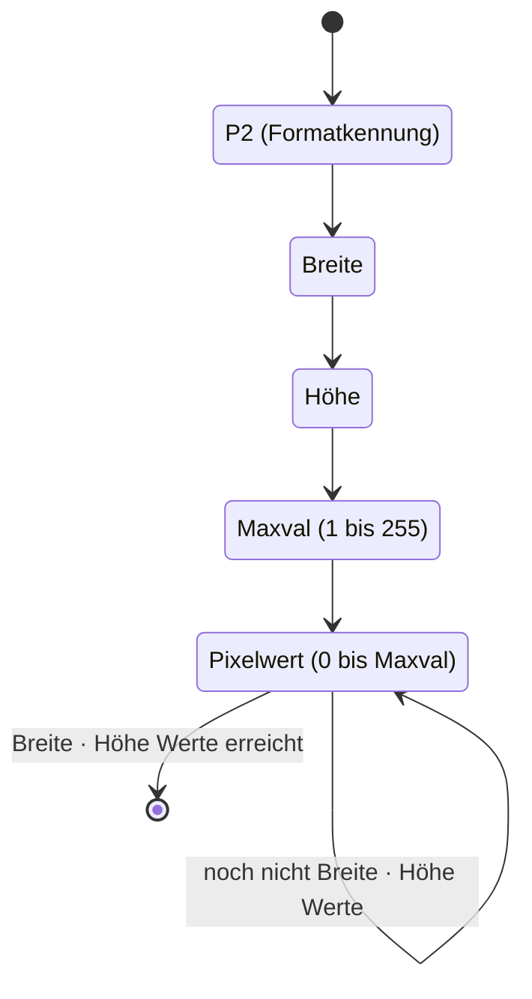

# Wie eine PGM-Datei aufgebaut ist

Quelle: Q3.pdf S. 6

```mermaid
stateDiagram-v2
    [*] --> P2
    P2 : P2 (Formatkennung)
    Breite : Breite
    Hoehe : Höhe
    Maxval : Maxval (1 bis 255)
    Pixel : Pixelwert (0 bis Maxval)
    P2 --> Breite
    Breite --> Hoehe
    Hoehe --> Maxval
    Maxval --> Pixel
    Pixel --> Pixel : noch nicht Breite · Höhe Werte
    Pixel --> [*] : Breite · Höhe Werte erreicht
```
