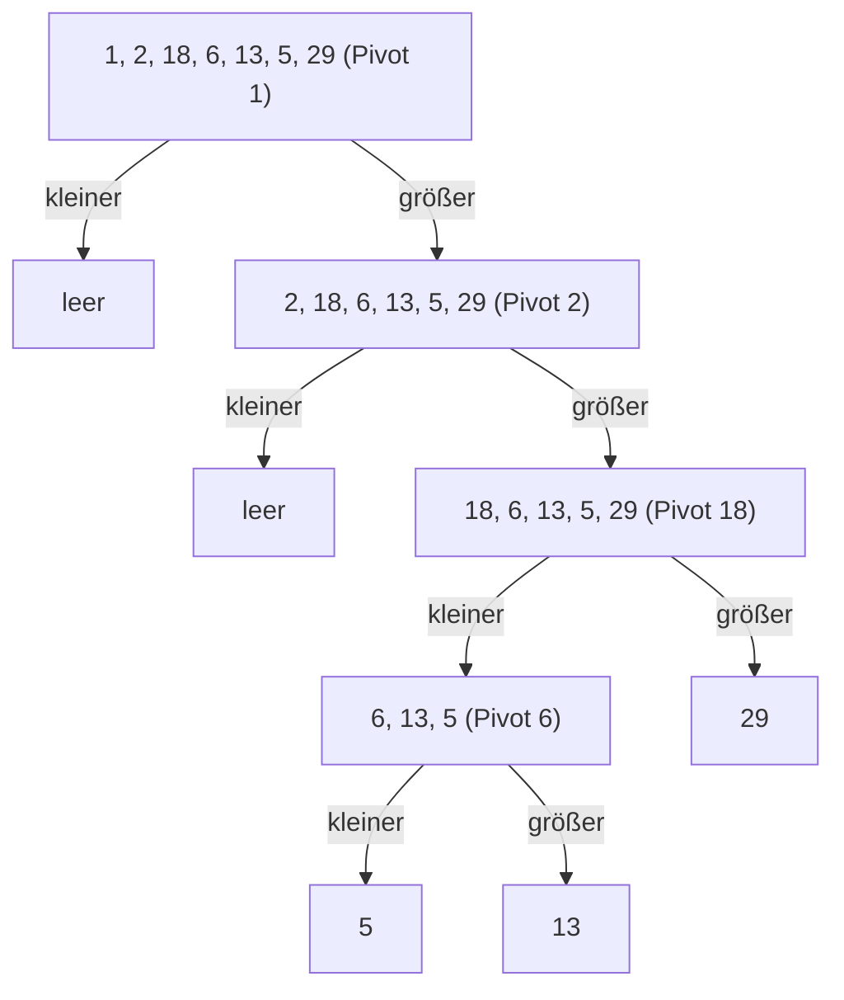

# Wie Quicksort 1, 2, 18, 6, 13, 5, 29 zerlegt

Quelle: Q1.2.pdf S. 57–58 und 64

```mermaid
flowchart TD
    A["1, 2, 18, 6, 13, 5, 29 (Pivot 1)"]
    A -- kleiner --> A0["leer"]
    A -- größer --> B["2, 18, 6, 13, 5, 29 (Pivot 2)"]
    B -- kleiner --> B0["leer"]
    B -- größer --> C["18, 6, 13, 5, 29 (Pivot 18)"]
    C -- kleiner --> D["6, 13, 5 (Pivot 6)"]
    C -- größer --> E["29"]
    D -- kleiner --> F["5"]
    D -- größer --> G["13"]
```
