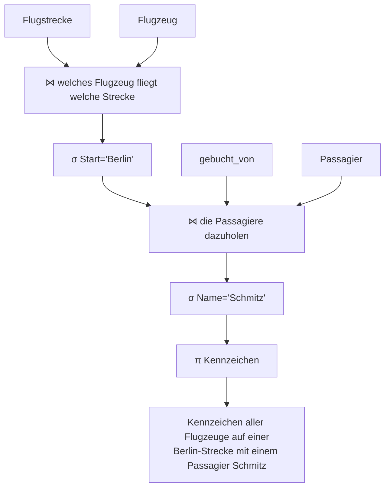

# Wie sich Aufgabe 5 von innen nach außen abarbeitet

Quelle: Q2.pdf S. 145

```mermaid
flowchart TD
    A["Flugstrecke"]
    B["Flugzeug"]
    J1["⋈ welches Flugzeug fliegt welche Strecke"]
    S1["σ Start='Berlin'"]
    C["gebucht_von"]
    D["Passagier"]
    J2["⋈ die Passagiere dazuholen"]
    S2["σ Name='Schmitz'"]
    P["π Kennzeichen"]
    E["Kennzeichen aller Flugzeuge auf einer<br>Berlin-Strecke mit einem Passagier Schmitz"]

    A --> J1
    B --> J1
    J1 --> S1
    S1 --> J2
    C --> J2
    D --> J2
    J2 --> S2
    S2 --> P
    P --> E
```
