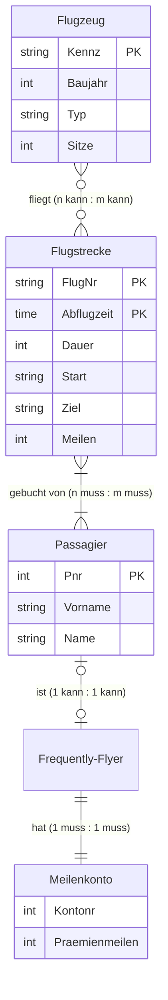

# Wie die Flugdatenbank zusammenhängt

Quelle: Q2.pdf S. 145

```mermaid
erDiagram
    Flugzeug }o--o{ Flugstrecke : "fliegt (n kann : m kann)"
    Flugstrecke }|--|{ Passagier : "gebucht von (n muss : m muss)"
    Passagier |o--o| "Frequently-Flyer" : "ist (1 kann : 1 kann)"
    "Frequently-Flyer" ||--|| Meilenkonto : "hat (1 muss : 1 muss)"
    Flugzeug {
        string Kennz PK
        int Baujahr
        string Typ
        int Sitze
    }
    Flugstrecke {
        string FlugNr PK
        time Abflugzeit PK
        int Dauer
        string Start
        string Ziel
        int Meilen
    }
    Passagier {
        int Pnr PK
        string Vorname
        string Name
    }
    Meilenkonto {
        int Kontonr
        int Praemienmeilen
    }
```
