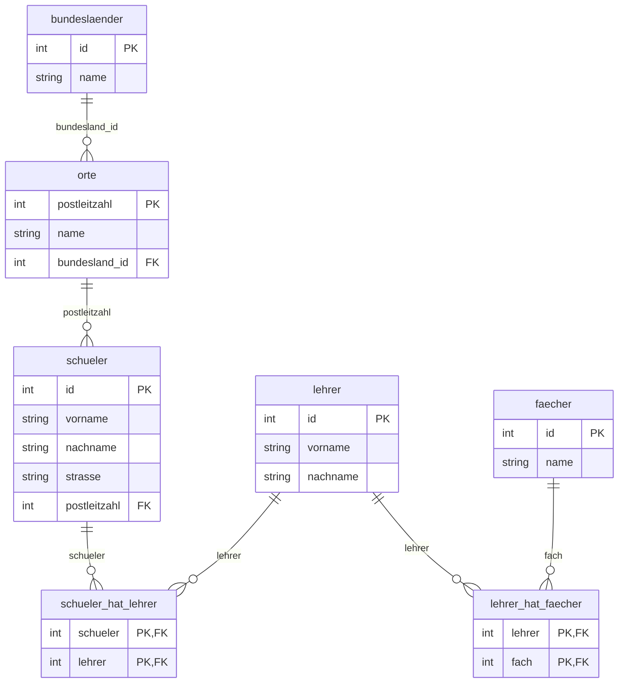

# Die sieben Tabellen der Schuldatenbank

Quelle: Q2.pdf S. 44

```mermaid
erDiagram
    bundeslaender ||--o{ orte : "bundesland_id"
    orte ||--o{ schueler : "postleitzahl"
    schueler ||--o{ schueler_hat_lehrer : "schueler"
    lehrer ||--o{ schueler_hat_lehrer : "lehrer"
    lehrer ||--o{ lehrer_hat_faecher : "lehrer"
    faecher ||--o{ lehrer_hat_faecher : "fach"
    bundeslaender {
        int id PK
        string name
    }
    orte {
        int postleitzahl PK
        string name
        int bundesland_id FK
    }
    schueler {
        int id PK
        string vorname
        string nachname
        string strasse
        int postleitzahl FK
    }
    schueler_hat_lehrer {
        int schueler PK, FK
        int lehrer PK, FK
    }
    lehrer {
        int id PK
        string vorname
        string nachname
    }
    lehrer_hat_faecher {
        int lehrer PK, FK
        int fach PK, FK
    }
    faecher {
        int id PK
        string name
    }
```
