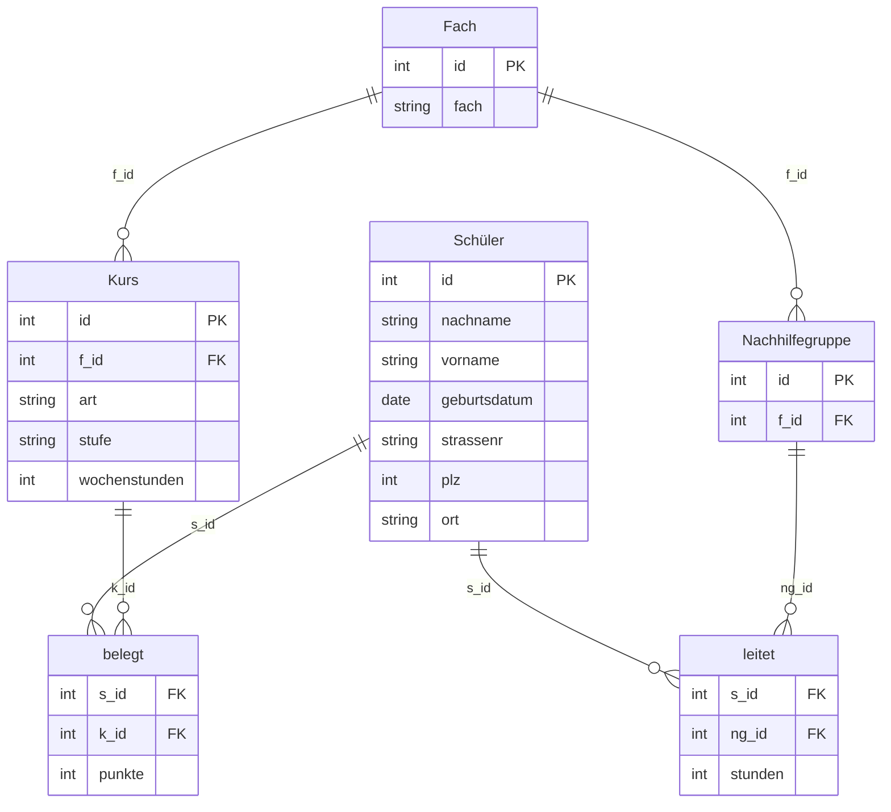

# Die Testdatenbank schule im Überblick

Quelle: Q2.pdf S. 133–135

```mermaid
erDiagram
    Fach ||--o{ Kurs : "f_id"
    Fach ||--o{ Nachhilfegruppe : "f_id"
    "Schüler" ||--o{ belegt : "s_id"
    Kurs ||--o{ belegt : "k_id"
    "Schüler" ||--o{ leitet : "s_id"
    Nachhilfegruppe ||--o{ leitet : "ng_id"
    "Schüler" {
        int id PK
        string nachname
        string vorname
        date geburtsdatum
        string strassenr
        int plz
        string ort
    }
    Fach {
        int id PK
        string fach
    }
    Kurs {
        int id PK
        int f_id FK
        string art
        string stufe
        int wochenstunden
    }
    belegt {
        int s_id FK
        int k_id FK
        int punkte
    }
    Nachhilfegruppe {
        int id PK
        int f_id FK
    }
    leitet {
        int s_id FK
        int ng_id FK
        int stunden
    }
```
