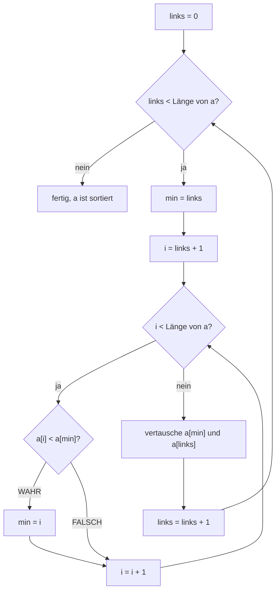

# Wie Selection Sort das Minimum nach vorne holt

Quelle: Q1.2.pdf S. 29

```mermaid
flowchart TD
    A["links = 0"] --> B{"links < Länge von a?"}
    B -- nein --> Z["fertig, a ist sortiert"]
    B -- ja --> C["min = links"]
    C --> D["i = links + 1"]
    D --> E{"i < Länge von a?"}
    E -- ja --> F{"a[i] < a[min]?"}
    F -- WAHR --> G["min = i"]
    F -- FALSCH --> H["i = i + 1"]
    G --> H
    H --> E
    E -- nein --> I["vertausche a[min] und a[links]"]
    I --> J["links = links + 1"]
    J --> B
```
