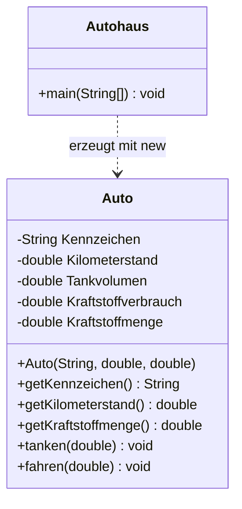

# Wie Auto und Autohaus zusammenhängen

Quelle: Q1.1.pdf S. 35–42

```mermaid
classDiagram
    class Auto {
        -String Kennzeichen
        -double Kilometerstand
        -double Tankvolumen
        -double Kraftstoffverbrauch
        -double Kraftstoffmenge
        +Auto(String, double, double)
        +getKennzeichen() String
        +getKilometerstand() double
        +getKraftstoffmenge() double
        +tanken(double) void
        +fahren(double) void
    }
    class Autohaus {
        +main(String[]) void
    }
    Autohaus ..> Auto : erzeugt mit new
```
