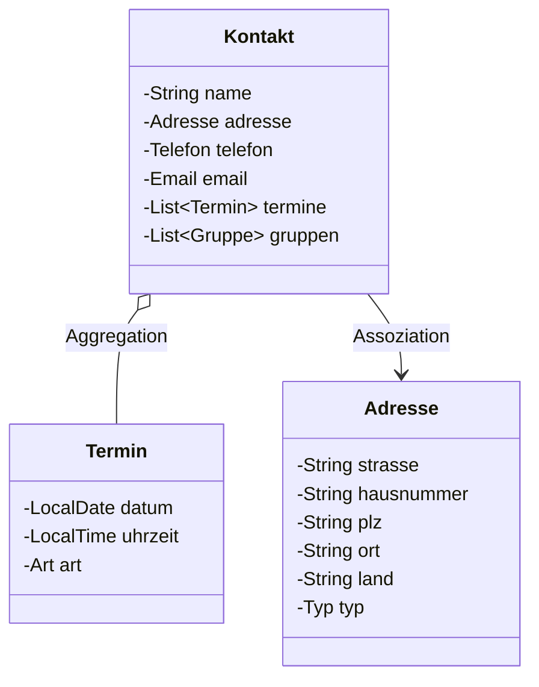

# Raute bei den Terminen, Pfeil bei der Adresse

Quelle: Q1.1.pdf S. 156–157

```mermaid
classDiagram
    class Kontakt {
        -String name
        -Adresse adresse
        -Telefon telefon
        -Email email
        -List~Termin~ termine
        -List~Gruppe~ gruppen
    }
    class Termin {
        -LocalDate datum
        -LocalTime uhrzeit
        -Art art
    }
    class Adresse {
        -String strasse
        -String hausnummer
        -String plz
        -String ort
        -String land
        -Typ typ
    }
    Kontakt o-- Termin : Aggregation
    Kontakt --> Adresse : Assoziation
```
