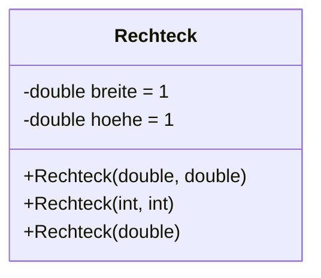

# Drei Konstruktoren, drei Parameterlisten

Quelle: Q1.1.pdf S. 82

```mermaid
classDiagram
    class Rechteck {
        -double breite = 1
        -double hoehe = 1
        +Rechteck(double, double)
        +Rechteck(int, int)
        +Rechteck(double)
    }
```
