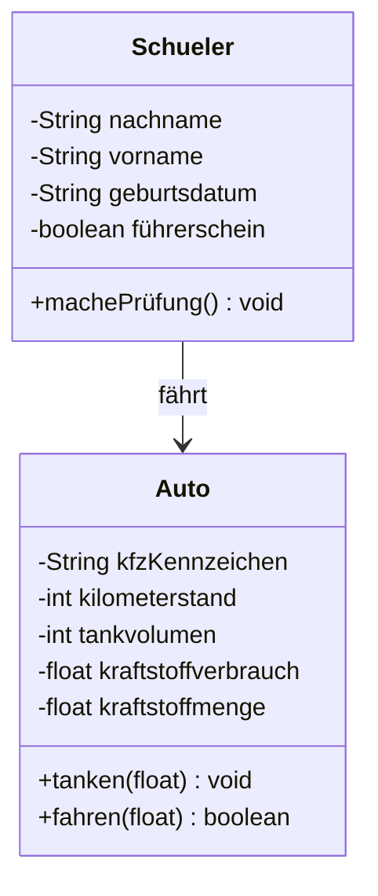

# Der Schüler kennt sein Auto

Quelle: Q1.1.pdf S. 145

```mermaid
classDiagram
    class Schueler {
        -String nachname
        -String vorname
        -String geburtsdatum
        -boolean führerschein
        +machePrüfung() void
    }
    class Auto {
        -String kfzKennzeichen
        -int kilometerstand
        -int tankvolumen
        -float kraftstoffverbrauch
        -float kraftstoffmenge
        +tanken(float) void
        +fahren(float) boolean
    }
    Schueler --> Auto : fährt
```
