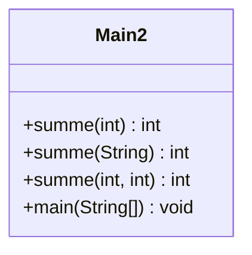

# Dreimal summe, jedes Mal andere Parameter

Quelle: Q1.1.pdf S. 134–136

```mermaid
classDiagram
    class Main2 {
        +summe(int) int
        +summe(String) int
        +summe(int, int) int
        +main(String[]) void
    }
```
