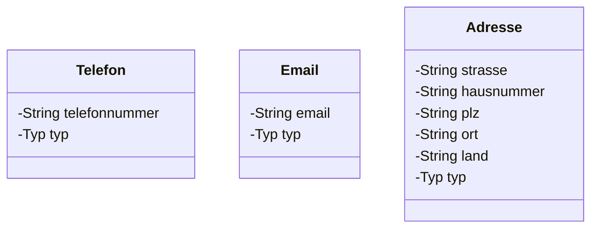

# Telefon, Email und Adresse haben alle einen Typ

Quelle: Q1.1.pdf S. 154

```mermaid
classDiagram
    class Telefon {
        -String telefonnummer
        -Typ typ
    }
    class Email {
        -String email
        -Typ typ
    }
    class Adresse {
        -String strasse
        -String hausnummer
        -String plz
        -String ort
        -String land
        -Typ typ
    }
```
