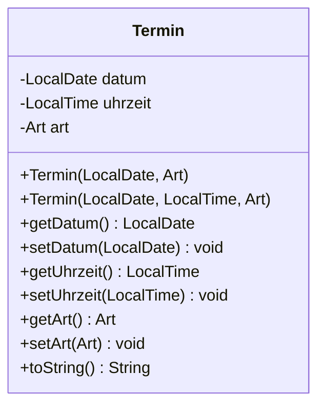

# Die Klasse Termin, wie sie im UML-Editor aussieht

Quelle: Q1.1.pdf S. 152–153

```mermaid
classDiagram
    class Termin {
        -LocalDate datum
        -LocalTime uhrzeit
        -Art art
        +Termin(LocalDate, Art)
        +Termin(LocalDate, LocalTime, Art)
        +getDatum() LocalDate
        +setDatum(LocalDate) void
        +getUhrzeit() LocalTime
        +setUhrzeit(LocalTime) void
        +getArt() Art
        +setArt(Art) void
        +toString() String
    }
```
