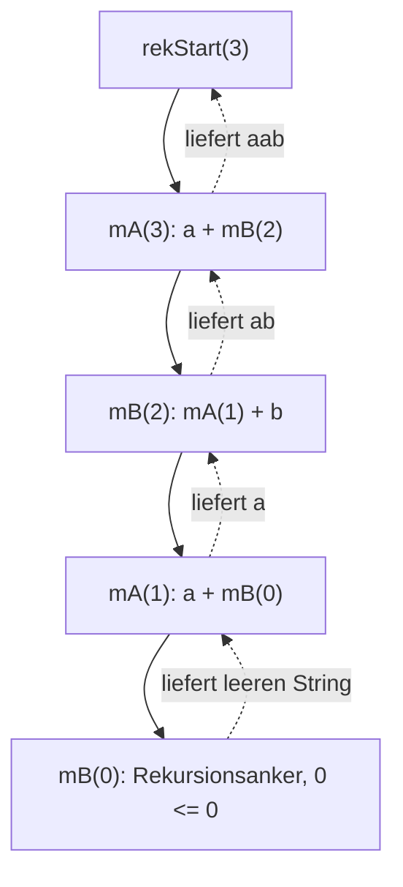

# Wie mA und mB sich gegenseitig aufrufen, bis aab dasteht

Quelle: Q1.2.pdf S. 41

```mermaid
flowchart TD
    S["rekStart(3)"] --> A3["mA(3): a + mB(2)"]
    A3 --> B2["mB(2): mA(1) + b"]
    B2 --> A1["mA(1): a + mB(0)"]
    A1 --> B0["mB(0): Rekursionsanker, 0 <= 0"]
    B0 -.->|liefert leeren String| A1
    A1 -.->|liefert a| B2
    B2 -.->|liefert ab| A3
    A3 -.->|liefert aab| S
```
